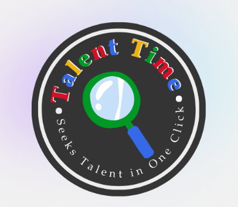

# TalentTime

“An AI-Powered Tool for filtering candidates”

TalentTime is an Applicant Tracking System (ATS) built using Google Workspace tools and Google Apps Script. It streamlines the hiring process by automating resume collection, candidate evaluation, and interview scheduling.

## Future Development Plans

TalentTime is currently in its Minimum Viable Product stage. 
**We have ambitious plans to enhance its functionality and user experience if we are able to qualify for the next stage(Top 8 Finalist)**.

Our roadmap includes:

1. **Interview Funnel and Google Calendar Schedulling Automation**
   Implement a comprehensive interview pipeline to track candidates through various stages of the hiring process.

2. **Enhanced Interactive Dashboard**
   Develop a more sophisticated, user-friendly dashboard with data visualization and real-time updates.

3. **Notion Database To Content Page Automation**
   Create an automated system to generate structured content pages in Notion from our database, streamlining information management and accessibility.

These planned features will significantly expand TalentTime's capabilities, making it an even more powerful tool for HR professionals and hiring managers.

---

## Teams

Chin Yong Khong - Consultant
(https://www.linkedin.com/in/chin-yong-khong/)

Lee Wen Xuan - Lead Programmer
(https://www.linkedin.com/in/leewenxuan/)

Chai Yi Mun - Programmer
(https://www.linkedin.com/in/chai-yi-mun-778512242/)

## Features

- Collect job applications through Google Forms
- Automatically extract and store resume information
- Calculate candidate scores based on keyword matching
- Provide an HR dashboard for candidate review and interview scheduling
- Send automated interview invitation emails

## Setup

### Prerequisites

- A Google Workspace account
- Access to Google Drive, Google Sheets, Google Forms, and Google Apps Script

### Installation

1. Create a new Google Sheet to store applicant data.
2. Set up a Google Form for job applications, linking it to the Google Sheet.
3. In Google Apps Script, create a new project.
4. Copy the contents of all file that has `.gs` into the script editor.
5. Create a new HTML file named `Index.html` and copy the provided HTML code.
6. Replace `'YOUR_SPREADSHEET_ID_HERE'` and other API key in the script.

### Deployment

1. In the Apps Script editor, click on "Deploy" > "New deployment".
2. Choose "Web app" as the deployment type.
3. Set "Execute as" to your account.
4. Set "Who has access" to the appropriate level for your organization.
5. Click "Deploy" and authorize the necessary permissions.
6. Copy the provided web app URL for accessing the HR dashboard.
7. Do not deploy the script that handle the form.
8. Deploy ATSKeyword.gs and HRDashboard.gs.

## Usage

### For Applicants

1. Applicants fill out the job application form, including uploading their resume.
2. The system automatically processes the application and extracts relevant information.

### For HR Personnel

1. Access the TalentTime dashboard using the deployed web app URL.
2. View a list of candidates with their names, email addresses, and score percentages.
3. Select interview dates and times for each candidate.
4. Send interview invitations directly from the dashboard.

## Functionality

### Resume Processing

- Extracts text from uploaded PDF resumes
- Performs keyword matching to calculate candidate scores

### Candidate Scoring

- Calculates a score percentage based on matched keywords
- Displays scores in the HR dashboard for easy comparison

### Interview Scheduling

- Allows HR to select interview dates and times for each candidate
- Sends automated email invitations with interview details

## Customization

- Modify the keyword list in `Code.gs` to match your job requirements
- Adjust the email template in the `sendInterviewEmail` function as needed

## Troubleshooting

- Ensure all required Google Workspace APIs are enabled
- Check the Apps Script execution log for any error messages
- Verify that the Google Sheet ID is correct and the sheet names match

## Support

For support, please contact any of us via linkedin as mentioned or open an issue in the project repository.

## Contributing

Contributions to TalentTime are welcome. Please fork the repository and submit a pull request with your proposed changes.

## License

TalentTime is released under the [MIT License](https://opensource.org/licenses/MIT).
